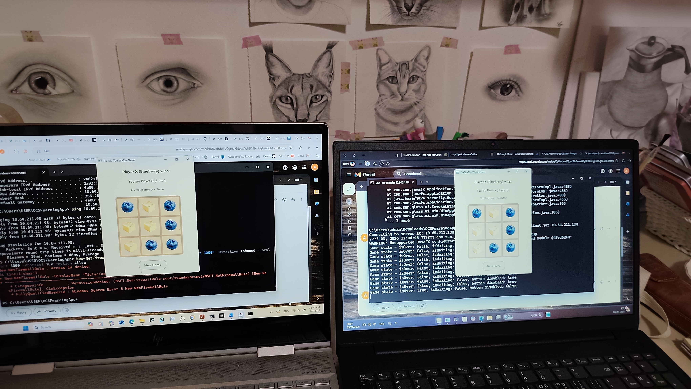
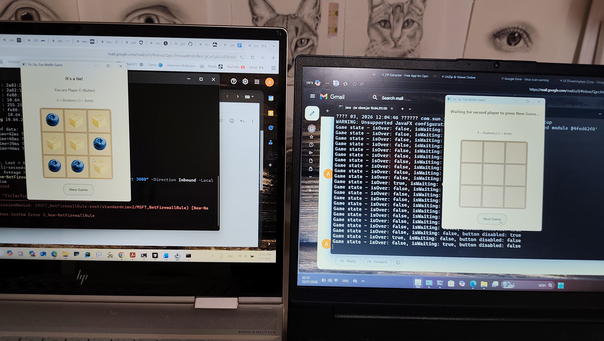
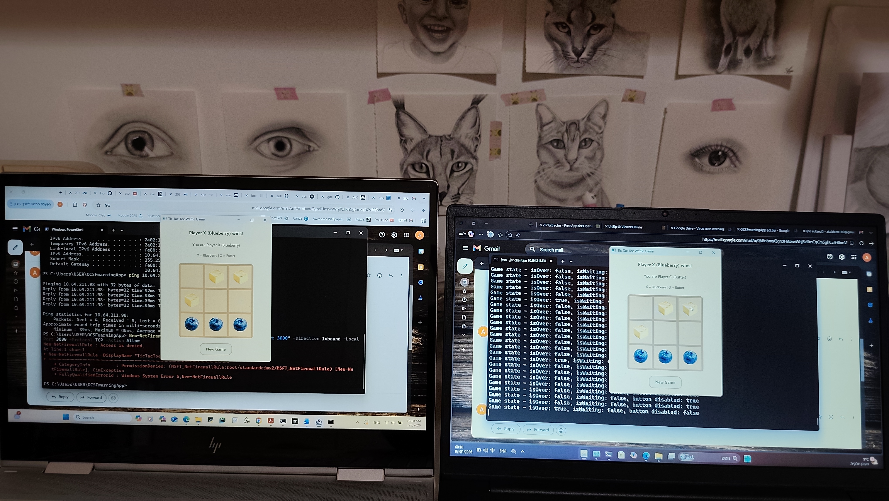

# דוח הגשה - משחק איקס-עיגול רב-משתתפים

## שמות הסטודנטים
ערין טרביה, מספר ת"ז: 214028904

איה חואלד, מספר ת"ז: 214742496

## הסבר קצר על המימוש

הפרויקט מיישם משחק איקס-עיגול רב-משתתפים באמצעות OCSF Framework. השרת מתאם את המשחק, שומר על מעקב אחר המהלכים של כל שחקן, ומעדכן כל שחקן לגבי המהלכים של השחקן השני.

### תכונות עיקריות:
- **שרת (Server)**: מנהל עד 2 שחקנים, מקצה X/O באופן אקראי, בוחר מי מתחיל באופן אקראי
- **לקוח (Client)**: ממשק משתמש גרפי ב-JavaFX עם לוח משחק 3x3
- **תקשורת**: שימוש ב-OCSF Framework לתקשורת בין שרת ללקוח
- **EventBus**: שימוש ב-EventBus (Mediator Pattern) להעברת אירועים בין רכיבי הלקוח

### מבנה הפרויקט:
- **entities**: מודול משותף המכיל את ישויות המשחק (GameState, Move, GameMessage)
- **server**: שרת OCSF המנהל את לוגיקת המשחק
- **client**: לקוח JavaFX עם ממשק משתמש גרפי

## הוראות הפעלה

### הרצה על אותו מחשב:

1. **הרצת השרת:**
   ```bash
   java -jar JAR/server.jar
   ```
   או באמצעות Maven:
   ```bash
   cd server
   mvn exec:java
   ```

2. **הרצת הלקוח:**
   ```bash
   java -jar JAR/client.jar
   ```
   או באמצעות Maven:
   ```bash
   cd client
   mvn javafx:run
   ```

3. **להרצת שני לקוחות במקביל:**
   - הרץ את הלקוח פעמיים (או הגדר ב-IDE: Run -> Modify Options -> Allow Multiple Instances)
   - השחקן הראשון יראה "מחכה לשחקן שני..."
   -שחקן השני מתחבר, המשחק מתחיל אוטומטית

### הרצה על שני מחשבים שונים:

1. **על המחשב הראשון (שרת):**
   - הרץ את השרת:
     ```bash
     java -jar JAR/server.jar
     ```
   - שים לב לכתובת IP של המחשב הזה

2. **על המחשב השני (לקוח):**
   - הרץ את הלקוח עם כתובת ה-IP של השרת:
     ```bash
     java -jar JAR/client.jar <SERVER_IP_ADDRESS>
     ```
   - לדוגמה:
     ```bash
     java -jar JAR/client.jar 10.64.211.130
     ```
   - אם לא מציינים IP, הלקוח יתחבר ל-localhost (להרצה על אותו מחשב)

3. **פתרון בעיית תקשורת בין 2 מחשבים:**
   - ודא ששני המחשבים באותה רשת
   - ודא שהפורט 3000 פתוח בפיירוול
   - אם יש בעיות, בדוק את הגדרות הרשת והפיירוול

### דרישות:
- Java 15 ומעלה
- JavaFX (כלול ב-JAR של הלקוח)

## לינק ל-Repository

https://github.com/ayakhawalid/Tic-Tac-Toe-Waffle-Game

## הוספת קבצי JAR ל-Repository

קבצי ה-JAR נמצאים בתיקייה `JAR/`:
- `JAR/server.jar` - קובץ השרת
- `JAR/client.jar` - קובץ הלקוח


## תמונות מהמשחק

### תמונות ממשק המשתמש:






.png)


